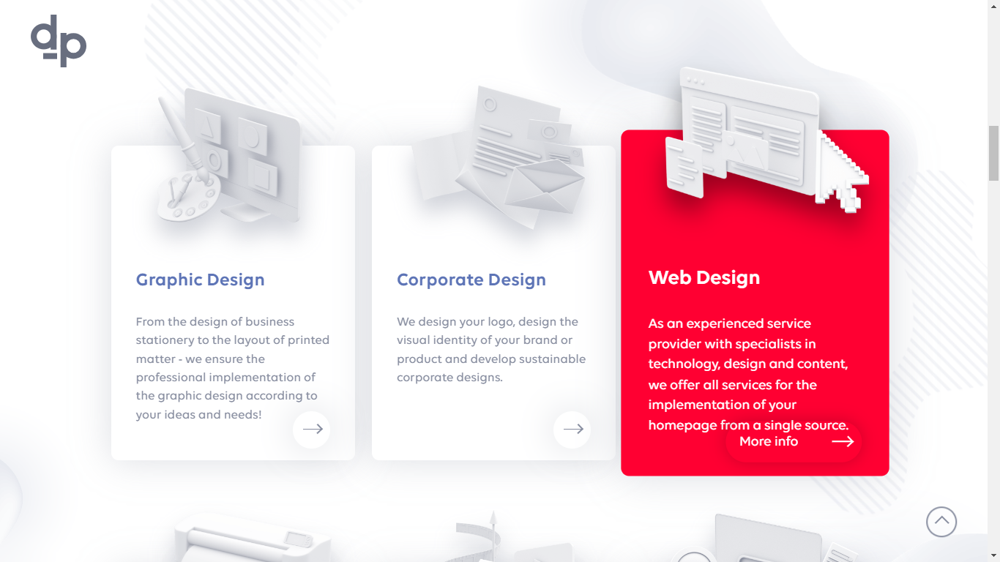
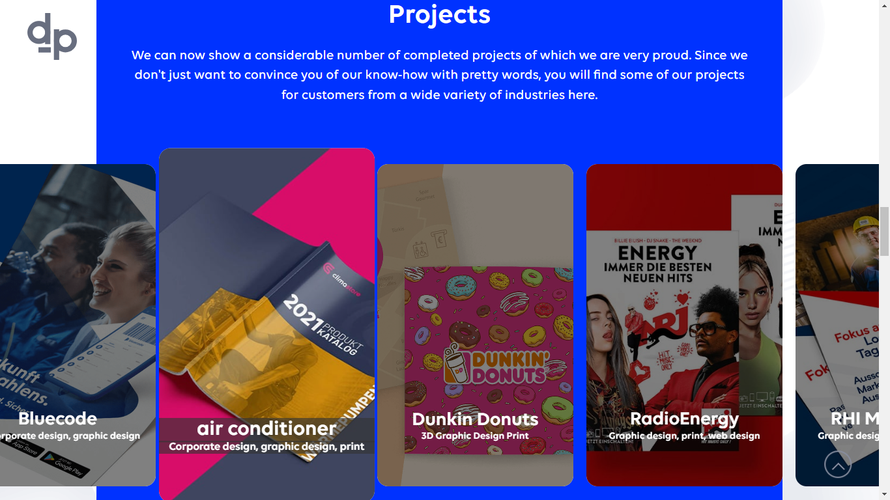

# 
My Dev-Program project

Best practice for improving HTML & CSS performance

<h3 align="center"><a href="https://negar-karimnejad.github.io/dev-program/" target="_blank">You can see this repo online</a></h3>

<section width="100%" display="flex" align="center" justify-content="center" gap="2rem">

  

</section>

--------------------------------------------------------------

### 
🔧Technologies:

  

  

